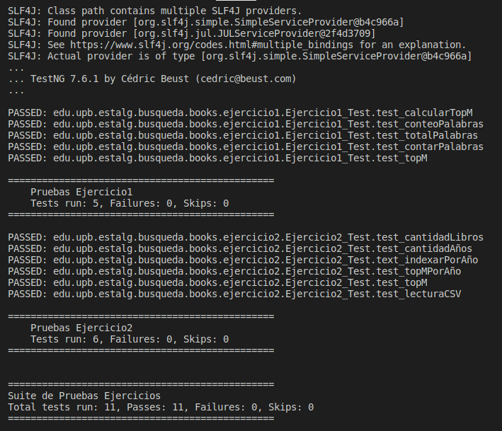

# HackathonQ4-2022

## Instrucciones

1. Unirse al proyecto y clonar el repositorio "Template"  

- [**Java**](https://classroom.github.com/a/axhf7mDr)  
Descargar las bibliotecas `.jar` y grabarlas en la carpeta `lib`.  

- [**Python**:](https://classroom.github.com/a/1uUZRys_)  

2. Resolver los dos ejercicios

3. Ejecutar las pruebas para comprobar el correcto funcionamiento de la solución
**Java** : Desde la consola ejecutar el comando  
Linux,MacOS: `java -cp "bin:lib/*" org.testng.TestNG testng.xml`  
Windows: `java -cp "bin;lib/*" org.testng.TestNG testng.xml`

4. Si las pruebas pasan satisfactoriamente se debe obtener una salida como la siguiente:

5. Hacer commit del proyecto concluído

